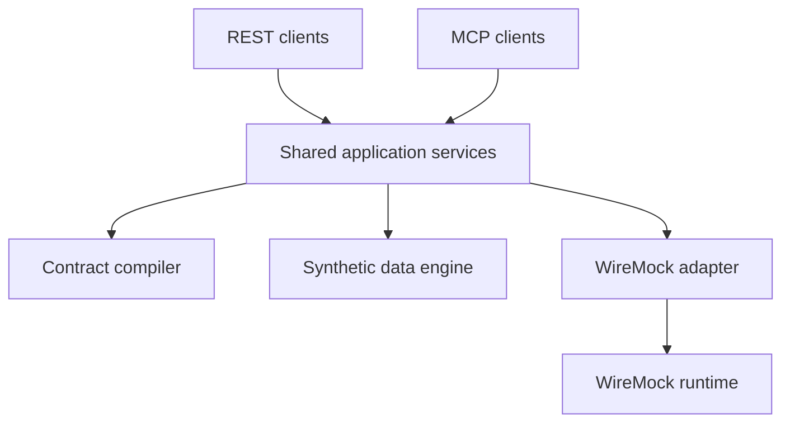

# SimuLoom MCP

SimuLoom is an open-source control plane for contract-driven service virtualization and
synthetic test-data management. An approved OpenAPI contract remains the source of truth;
the same deterministic application services are available through REST and MCP.

> Status: early MVP (`v0.8.0`). All example records are fictional and synthetic.

## What works in this milestone

- Analyze an OpenAPI 3.x contract and calculate a stable fingerprint.
- Create a versioned local simulation workspace.
- Generate reproducible synthetic requests from arbitrary OpenAPI JSON schemas.
- Populate path, query, header, cookie, and JSON request-body inputs.
- Compile successful OpenAPI responses into WireMock mappings.
- Preview validation cases before deployment and cover every contract operation.
- Inspect generated datasets through REST or MCP resources.
- Turn synthetic member records into exact, correlated request/response mappings.
- Configure portable, contract-validated multi-step scenarios.
- Inspect, deploy, and reset individual WireMock scenario state.
- Reset every deployed scenario through an admin-only operation.
- Return a deterministic 404 response for unknown synthetic member IDs.
- Activate normal, slow, unavailable, and deterministic intermittent profiles.
- Simulate a contract-backed `SUBMITTED → PROCESSING → COMPLETED` journey.
- Execute live validation cases against WireMock and validate 2xx response schemas.
- Calculate operation/scenario coverage and capture unmatched WireMock traffic.
- Publish machine-readable JSON and human-readable HTML evidence.
- Export reproducible, Git-friendly `simulation.yaml` bundles.
- Safely import portable bundles and regenerate mappings from approved source artifacts.
- Authenticate REST and MCP clients with role-scoped API keys.
- Record request outcomes in a tamper-evident JSONL audit chain.
- Deploy mappings through the WireMock Admin API.
- Invoke the workflow through REST or MCP Streamable HTTP.

## Architecture



## Run with Docker

```bash
docker compose up --build
```

- REST and Swagger UI: `http://localhost:8000/docs`
- MCP Streamable HTTP: `http://localhost:8000/mcp`
- WireMock runtime: `http://localhost:8080`

## Run locally

```bash
uv sync --extra dev
uv run uvicorn simuloom.main:app --reload
```

Run WireMock separately or override `WIREMOCK_URL` to point to an existing instance.

## Authentication and roles

Authentication is disabled by default for local evaluation. Enable it with environment
variables or copy `.env.example` to a private `.env` file and replace every example secret:

```bash
export SIMULOOM_AUTH_ENABLED=true
export SIMULOOM_API_KEYS='{
  "replace-viewer-key": {"subject": "reviewer", "role": "viewer"},
  "replace-operator-key": {"subject": "qa-engineer", "role": "operator"},
  "replace-admin-key": {"subject": "platform-owner", "role": "admin"}
}'
export SIMULOOM_AUDIT_SIGNING_KEY='replace-with-a-long-random-secret'
```

When authentication is enabled, SimuLoom refuses to start without at least one valid key.
Clients can send either `Authorization: Bearer <key>` or `X-API-Key: <key>`. The same headers
protect `/mcp`.

| Role | Access |
| --- | --- |
| `viewer` | Analyze contracts and read simulations, datasets, plans, manifests, exports, and reports |
| `operator` | Viewer access plus create, generate, compile, profile, deploy, validate, and import |
| `admin` | Operator access plus reset all WireMock mappings and inspect audit evidence |

```bash
curl -H "Authorization: Bearer $SIMULOOM_KEY" \
  http://localhost:8000/api/v1/simulations/example-id/manifest
```

Terminate TLS in front of SimuLoom outside local development. Keep API keys and the audit
signing key in a secret manager; never commit them to Git.

## REST quick start

Convert the YAML example to JSON or use the Swagger UI to submit it as the `contract`
field in these calls:

```text
POST /api/v1/contracts/analyze
POST /api/v1/simulations
POST /api/v1/simulations/{id}/data
GET  /api/v1/simulations/{id}/data
POST /api/v1/simulations/{id}/compile
PUT  /api/v1/simulations/{id}/scenarios/{scenario_id}
GET  /api/v1/simulations/{id}/scenarios/{scenario_id}
GET  /api/v1/simulations/{id}/scenarios/{scenario_id}/state
POST /api/v1/simulations/{id}/scenarios/{scenario_id}/compile
POST /api/v1/simulations/{id}/scenarios/{scenario_id}/deploy
POST /api/v1/simulations/{id}/scenarios/{scenario_id}/reset
POST /api/v1/scenarios/reset
PUT  /api/v1/simulations/{id}/profiles/{profile}
POST /api/v1/simulations/{id}/validation/plan
POST /api/v1/simulations/{id}/deploy
POST /api/v1/simulations/{id}/validate
GET  /api/v1/simulations/{id}/reports/latest
GET  /api/v1/simulations/{id}/reports/latest/html
POST /api/v1/simulations/{id}/export
GET  /api/v1/simulations/{id}/manifest
GET  /api/v1/simulations/{id}/export/bundle
POST /api/v1/simulations/import
GET  /api/v1/audit/events
GET  /api/v1/audit/verify
```

The simulation creation request shape is:

```json
{
  "name": "Eligibility Demo",
  "contract": {
    "openapi": "3.1.0",
    "info": {"title": "Example", "version": "1.0.0"},
    "paths": {
      "/ping": {
        "get": {
          "operationId": "ping",
          "responses": {"200": {"description": "OK"}}
        }
      }
    }
  }
}
```

Use either complete example from `examples/catalog-orders/openapi.yaml` or
`examples/benefits-eligibility/openapi.yaml`; the shortened object above only illustrates
the envelope.

## Generic OpenAPI workflow

For contracts outside the eligibility example, `POST /simulations/{id}/data` generates
deterministic `contract-cases`. SimuLoom cycles through contract operations and derives
fictional inputs from parameter and request-body schemas. Common JSON Schema features include
objects, arrays, local `$ref`, `allOf`, `oneOf`, `anyOf`, enums, constants, defaults, examples,
numeric bounds, string lengths, and common formats such as date, UUID, email, and URI.

```text
POST /api/v1/simulations/{id}/data
{"records": 6, "seed": 1207}

GET /api/v1/simulations/{id}/data

POST /api/v1/simulations/{id}/validation/plan
{"max_dataset_cases": 6}
```

Each generated case records its operation, resolved path and query, required headers, JSON
body, expected success status, and schema-derived response. Exact case mappings receive a
higher WireMock priority while contract-level mappings remain available as fallbacks. If the
stored dataset does not cover every operation, the validation planner adds deterministic
baseline cases so operation coverage remains complete.

The current generic engine targets JSON request/response operations with local OpenAPI
references. External references, callbacks, webhooks, multipart bodies, and authentication
token generation remain future extensions.

## Eligibility accelerator

After generating data and compiling, each generated member can be called directly:

```text
GET http://localhost:8080/eligibility/SYN-1207-000001
```

The response uses the correlated status, plan, and effective date from that member's
synthetic dataset record. Any other member ID returns `404 MEMBER_NOT_FOUND`.

## Stateful scenario orchestration

A simulation can contain portable, contract-validated business scenarios. Every handler is
compiled with WireMock `scenarioName`, `requiredScenarioState`, and, for transitions,
`newScenarioState`. State-preserving handlers make inspection responses deterministic
without advancing the workflow.

```text
PUT  /api/v1/simulations/{id}/scenarios/{scenario_id}
GET  /api/v1/simulations/{id}/scenarios/{scenario_id}
GET  /api/v1/simulations/{id}/scenarios/{scenario_id}/state
POST /api/v1/simulations/{id}/scenarios/{scenario_id}/compile
POST /api/v1/simulations/{id}/scenarios/{scenario_id}/deploy
POST /api/v1/simulations/{id}/scenarios/{scenario_id}/reset
POST /api/v1/scenarios/reset
```

The individual reset operation requires operator access. The global reset affects the shared
WireMock runtime and requires admin. Definitions and live state are reported separately so a
stopped or externally modified WireMock instance is not mistaken for stored configuration.

See [the copy-paste order lifecycle walkthrough](examples/order-lifecycle/README.md) for
create, pending, payment, paid, shipment, shipped, and reset calls. Detailed endpoint and
model rules are in [the scenario API guide](docs/api.md).


## Behavior profiles

Activate a profile before deployment:

```text
PUT /api/v1/simulations/{id}/profiles/slow
{"fixed_delay_ms": 2500, "failure_status": 503}
```

| Profile | Compiled behavior |
| --- | --- |
| `normal` | Contract and dataset responses without injected disruption |
| `slow` | Adds a fixed response delay to every compiled mapping |
| `unavailable` | Returns the configured 5xx status with a controlled error body |
| `intermittent` | Deterministically alternates normal and 5xx responses |

The intermittent profile is deterministic so the same test sequence can be reproduced.
Contract-backed business journeys retain their own state machine.

## Stateful journey

The approved example contract contains asynchronous eligibility operations:

```text
POST /eligibility/requests
→ 202 {"requestId":"REQ-SYN-001","status":"SUBMITTED"}

GET /eligibility/requests/REQ-SYN-001
→ 200 {"status":"PROCESSING"}

GET /eligibility/requests/REQ-SYN-001
→ 200 {"status":"COMPLETED"}
```

## Validation evidence

Deploy the current compiled bundle before running live validation:

```text
POST /api/v1/simulations/{id}/deploy
{"reset_existing": false}

POST /api/v1/simulations/{id}/validate
{"max_dataset_cases": 3, "reset_runtime_state": true}
```

The evidence engine:

1. Resets WireMock request and scenario state when requested.
2. Executes generic contract cases or the specialized eligibility scenarios.
3. Compares actual and expected HTTP statuses.
4. Validates successful JSON responses against the approved OpenAPI schemas.
5. Calculates operation and scenario-category coverage.
6. Reads the WireMock request journal and counts unmatched requests.
7. Saves `reports/latest.json` and `reports/latest.html`.

The HTML report provides a compact dashboard and a case-by-case evidence table. A failed
schema assertion, unexpected status, execution error, or unmatched request makes the overall
report fail.

## Portable simulations

Exporting a simulation produces a deterministic ZIP archive containing a versioned
`simulation.yaml`, its approved OpenAPI contract, the active behavior profile, and any
synthetic dataset. The manifest records contract and dataset fingerprints, making changes
reviewable in Git and integrity-checkable during import.

```yaml
apiVersion: simuloom.io/v1alpha1
kind: Simulation
metadata:
  name: Eligibility Demo
spec:
  contract:
    path: contract.json
    fingerprint: 725faa5388ca1bc1
  behavior:
    profile:
      name: normal
      fixedDelayMs: 2000
      failureStatus: 503
```

Download a bundle with `GET /api/v1/simulations/{id}/export/bundle`. Import one as a
multipart file named `bundle` with `POST /api/v1/simulations/import`.

Imports reject unknown or duplicate artifacts, unsafe paths, oversized archives, fingerprint
mismatches, non-synthetic records, and behavior-profile drift. Bundled mappings are never
trusted: SimuLoom recompiles them from the validated contract, dataset, and profile.

## MCP tools

- `analyze_contract`
- `create_simulation`
- `generate_test_data`
- `plan_validation`
- `compile_wiremock_bundle`
- `activate_profile`
- `deploy_simulation`
- `run_validation`
- `export_simulation`
- `import_simulation_bundle`
- `configure_scenario`
- `inspect_scenario`
- `compile_scenario`
- `deploy_scenario`
- `reset_scenario`
- `reset_all_scenarios`

Read-only simulation metadata is available as
`simulation://{simulation_id}/manifest`.

The portable YAML is available as
`simulation://{simulation_id}/portable-manifest`.

The current synthetic dataset is available as
`dataset://{simulation_id}/current`.

The latest evidence is available as `evidence://{simulation_id}/latest`.


Scenario definitions are available as
`scenario://{simulation_id}/{scenario_id}/definition`.

Live runtime state is available as
`scenario://{simulation_id}/{scenario_id}/state`.

Deployment preserves existing WireMock mappings by default. Set `reset_existing` explicitly
only when SimuLoom owns the entire target WireMock instance. This reset requires `admin`.

## Audit evidence

Every authenticated REST or MCP request records its subject, role, non-secret key identifier,
method, path, response status, outcome, request ID, and duration in `audit/events.jsonl` under
the configured workspace. API-key values and request/response bodies are never recorded.

Each event includes the previous event hash. When `SIMULOOM_AUDIT_SIGNING_KEY` is set, the
chain uses HMAC-SHA256; otherwise it uses an unkeyed SHA-256 chain suitable for local demos.
Admins can retrieve recent events from `/api/v1/audit/events` and verify the complete chain at
`/api/v1/audit/verify`. SimuLoom also verifies the existing chain during startup and refuses to
append to a corrupted log.

## Guardrails

- SimuLoom does not generate or alter API contracts using an LLM.
- Only approved OpenAPI input is compiled.
- Generated example datasets are marked `synthetic: true`.
- Never copy client endpoints, schemas, payloads, credentials, or production data into a
  public simulation.
- Review `SECURITY.md` before exposing SimuLoom outside a local development environment.

## Next milestones

1. Pluggable data generators and runtime adapters beyond WireMock.
2. Schema-derived negative, boundary, and pairwise validation cases.
3. External identity-provider integration and short-lived credentials.

## License

MIT. WireMock is a separate Apache-2.0-licensed project and is consumed as an external
runtime container.
