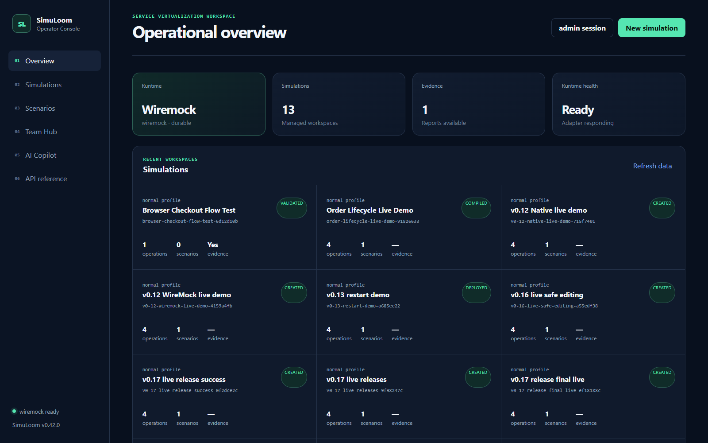
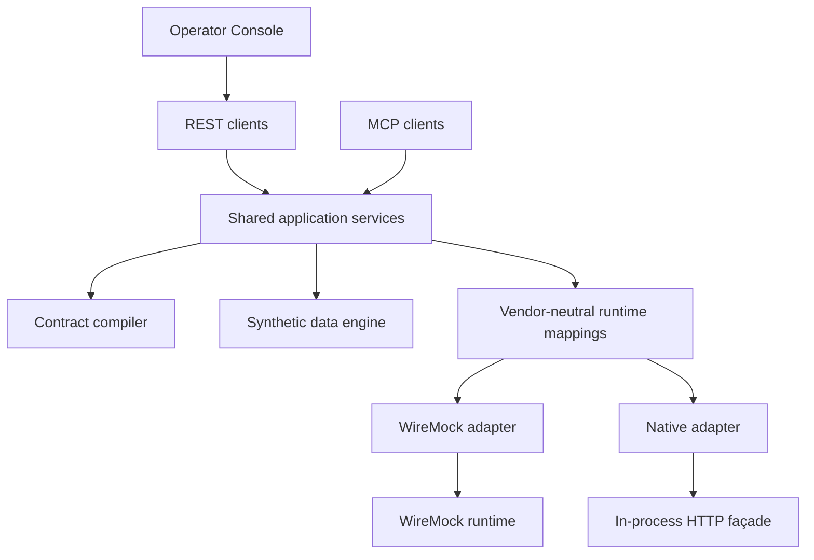

# SimuLoom MCP

[](https://github.com/anzar-ahsan-commits/simuloom-mcp/actions/workflows/ci.yml)
[](https://github.com/anzar-ahsan-commits/simuloom-mcp/actions/workflows/codeql.yml)
[](https://pypi.org/project/simuloom-mcp/)
[](https://github.com/anzar-ahsan-commits/simuloom-mcp/releases/latest)
[](https://www.python.org/)
[](LICENSE)

Your frontend is ready. The order API is not. The payment sandbox is shared, flaky, and cannot
reliably reproduce the failure your team needs to fix before Friday's demo.

**SimuLoom turns an approved OpenAPI contract into a virtual service you can actually drive:**
realistic synthetic data, stateful business journeys, controlled failures, and evidence showing
what was tested. It gives developers, QA engineers, CI pipelines, and AI clients the same
deterministic source of truth through a web console, REST, and MCP.

> Status: public beta (`v0.42.0`). All example records are fictional and synthetic.

Start the [five-minute order-lifecycle walkthrough](docs/launch.md), explore the
[technical guide](docs/technical-guide.md), or see [contribution guidance](CONTRIBUTING.md).



_One place to design a dependency, run it, break it on purpose, and prove how it behaved._

## See the idea in 60 seconds

Suppose a checkout team depends on an order service that is still being built. They have an
OpenAPI file, but they also need the service to remember what happened:

```text
NOT_CREATED ── create order ──> PENDING ── pay ──> PAID ── ship ──> SHIPPED
```

With SimuLoom, that team can:

1. Import the approved contract—without copying production traffic or customer records.
2. Generate clearly fictional, repeatable orders such as `ORD-SYN-001`.
3. Build the lifecycle visually and deploy it to WireMock or SimuLoom's native runtime.
4. Make the dependency slow, unavailable, or intermittently failing to exercise client recovery.
5. Validate normal, boundary, negative, pairwise, and state-transition behavior.
6. Hand reviewers JSON/HTML evidence instead of saying, “it worked on my machine.”

That same simulation can be operated by a person in the console, a CI job over REST, or an AI
client through MCP. All three use the same server-side validation and authorization rules.

## When SimuLoom is useful

| Situation | What SimuLoom gives you |
| --- | --- |
| An upstream team has published OpenAPI but not a working service | A contract-derived endpoint your client team can use today |
| A shared sandbox changes underneath the test suite | Seeded synthetic data and deterministic responses |
| A bug happens only after several business steps | Stateful, resettable scenario journeys with verified transitions |
| Retry, timeout, and error handling are hard to trigger safely | Controlled slow, unavailable, intermittent, and transport-fault behavior |
| Happy-path tests pass but important combinations remain untested | Boundary, negative, and bounded pairwise case generation |
| Reviewers ask what was actually exercised | Machine-readable JSON and human-readable HTML evidence |
| An AI assistant needs to understand or operate the environment | Grounded MCP/Copilot context with allowlisted, human-approved actions |

## Why this is more than another mock server

- **Contract-first:** the OpenAPI document—not a prompt or copied payload—is authoritative.
- **Business-state aware:** requests can move through realistic workflows, not isolated canned
  responses.
- **Deterministic by design:** the same contract, seed, and configuration reproduce the same test
  environment.
- **Evidence-producing:** SimuLoom measures operation, constraint, pair, state, and transition
  coverage.
- **Human-governed AI:** local Ollama can explain evidence and propose a bounded action, but it
  cannot silently save, approve, deploy, access secrets, or execute arbitrary tools.
- **Portable and automatable:** use the console, REST, MCP, GitOps snapshots, Python packages, or a
  versioned container without creating separate implementations.

<details>
<summary><strong>Explore the full capability map</strong></summary>

- Analyze OpenAPI 3.x operations, schemas, documented responses, and stable fingerprints.
- Generate deterministic synthetic path, query, header, cookie, and JSON-body inputs.
- Compile exact dataset mappings, contract fallbacks, behavior profiles, scenarios, edge cases,
  and pairwise cases into vendor-neutral runtime definitions.
- Deploy to WireMock or a durable native runtime with capability discovery and request journals.
- Design stateful scenarios visually with revisions, ETags, semantic comparison, reviews,
  immutable releases, rollback, promotion, and parameterized templates.
- Validate response schemas and report operation, scenario, state, transition, boundary, negative,
  and pairwise coverage in JSON and HTML.
- Simulate delays, unavailability, deterministic intermittent behavior, transport faults, virtual
  time, and safe inbound events.
- Export portable bundles and integrity-protected GitOps snapshots; detect drift from CI.
- Manage role-scoped team workspaces, encrypted secrets, signed integrations, durable jobs,
  metrics, audit chains, backups, and readiness diagnostics.
- Use an optional local Ollama Copilot for evidence-grounded explanations and approval-gated
  `generate`, `compile`, `deploy`, or single-scenario reset proposals.
- Run as a non-root Python package/container with Compose and single-replica Kubernetes examples.

</details>

## Architecture



## Run with Docker

```bash
docker compose up --build
```

- REST and Swagger UI: `http://localhost:8000/docs`
- Operator Console: `http://localhost:8000/ui`
- MCP Streamable HTTP: `http://localhost:8000/mcp`
- WireMock runtime: `http://localhost:8080`

Verify liveness and authenticated readiness (the API key header is optional when authentication
is disabled):

```bash
curl --fail http://localhost:8000/api/v1/health
curl --fail http://localhost:8000/api/v1/readiness \
  -H "X-API-Key: ${SIMULOOM_API_KEY:-}"
```

WireMock remains the default. To use the native runtime instead:

```bash
SIMULOOM_RUNTIME=native docker compose up --build
curl http://localhost:8000/api/v1/runtime
```

Deployed virtual services are then available under
`http://localhost:8000/runtime/{simulation_id}/{service_path}`. Each simulation has isolated
mappings, scenario state, and journal entries. Docker stores the native SQLite database in
the existing workspace volume, so deployed behavior resumes after restart.

## Run locally

```bash
uv sync --extra dev
uv run uvicorn simuloom.main:app --reload
```

Run WireMock separately or override `WIREMOCK_URL` to point to an existing instance. For a
dependency-free local runtime, set `SIMULOOM_RUNTIME=native`; optionally set
`SIMULOOM_NATIVE_RUNTIME_URL` to the externally reachable façade URL.

Native storage defaults to SQLite at `workspace/runtime/native.db`. Set
`SIMULOOM_NATIVE_RUNTIME_STORE=memory` for an ephemeral run, or configure
`SIMULOOM_NATIVE_RUNTIME_DB` and `SIMULOOM_NATIVE_JOURNAL_LIMIT` (default `1000` events per
simulation). Capability discovery reports the active storage mode and retention limit.

## Operator Console

Open `http://localhost:8000/ui` after starting SimuLoom. The console can upload a bounded
OpenAPI YAML/JSON contract, list and inspect workspaces, generate data, compile and deploy,
activate profiles, preview and execute validation, inspect evidence, export bundles, and
inspect or reset scenario state.

The **Scenarios** workspace lists stored scenarios and approved contract operations. Operators
can create states and handlers, select contract methods and paths, configure query/header/body
matchers, define deterministic responses and transitions, and save, compile, deploy, inspect,
or reset the result. The graph highlights initial, unreachable, terminal, and self-transition
behavior. Scenario definitions can be imported or exported as portable JSON.

When authentication is enabled, select **API key** and enter a viewer, operator, or admin key.
The key is kept in browser `sessionStorage`, which is isolated to the current tab and cleared
when that tab closes. Viewer sessions can inspect and plan; mutation controls require operator
or admin access. The console has no external scripts, fonts, analytics, or CDN dependency.

## Authentication and roles

Authentication is disabled by default for local evaluation. Enable it with environment
variables or copy `.env.example` to a private `.env` file and replace every example secret:

```bash
export SIMULOOM_AUTH_ENABLED=true
export SIMULOOM_API_KEYS='{
  "replace-viewer-key": {"subject": "reviewer", "role": "viewer"},
  "replace-operator-key": {"subject": "qa-engineer", "role": "operator"},
  "replace-admin-key": {"subject": "platform-owner", "role": "admin"}
}'
export SIMULOOM_AUDIT_SIGNING_KEY='replace-with-a-long-random-secret'
```

When authentication is enabled, SimuLoom refuses to start without at least one valid key.
Clients can send either `Authorization: Bearer <key>` or `X-API-Key: <key>`. The same headers
protect `/mcp`.

| Role | Access |
| --- | --- |
| `viewer` | Analyze contracts and read simulations, datasets, plans, manifests, exports, and reports |
| `operator` | Viewer access plus create, generate, compile, profile, deploy, validate, and import |
| `admin` | Operator access plus reset all WireMock mappings and inspect audit evidence |

```bash
curl -H "Authorization: Bearer $SIMULOOM_KEY" \
  http://localhost:8000/api/v1/simulations/example-id/manifest
```

Terminate TLS in front of SimuLoom outside local development. Keep API keys and the audit
signing key in a secret manager; never commit them to Git.

## REST quick start

Convert the YAML example to JSON or use the Swagger UI to submit it as the `contract`
field in these calls:

```text
POST /api/v1/contracts/analyze
POST /api/v1/simulations
GET  /api/v1/simulations
POST /api/v1/simulations/from-contract
POST /api/v1/simulations/{id}/data
GET  /api/v1/simulations/{id}/data
POST /api/v1/simulations/{id}/compile
PUT  /api/v1/simulations/{id}/scenarios/{scenario_id}
GET  /api/v1/simulations/{id}/scenarios/{scenario_id}
GET  /api/v1/simulations/{id}/scenarios/{scenario_id}/history
GET  /api/v1/simulations/{id}/scenarios/{scenario_id}/history/{revision}
POST /api/v1/simulations/{id}/scenarios/{scenario_id}/history/{revision}/restore
GET  /api/v1/simulations/{id}/scenarios/{scenario_id}/history/compare
POST /api/v1/simulations/{id}/scenarios/{scenario_id}/history/{revision}/deploy
GET  /api/v1/simulations/{id}/scenarios/{scenario_id}/releases
GET  /api/v1/simulations/{id}/scenarios/{scenario_id}/releases/{release_number}
POST /api/v1/simulations/{id}/scenarios/{scenario_id}/releases/{release_number}/rollback
GET  /api/v1/simulations/{id}/release-policy
PUT  /api/v1/simulations/{id}/release-policy
POST /api/v1/simulations/{id}/scenarios/{scenario_id}/history/{revision}/review
GET  /api/v1/simulations/{id}/scenarios/{scenario_id}/reviews
POST /api/v1/simulations/{id}/scenarios/{scenario_id}/reviews/{review}/approve
POST /api/v1/simulations/{id}/scenarios/{scenario_id}/reviews/{review}/reject
POST /api/v1/simulations/{id}/scenarios/{scenario_id}/history/{revision}/promote
GET  /api/v1/scenario-templates
POST /api/v1/scenario-templates/{template_id}/instantiate
POST /api/v1/simulations/{id}/scenarios/{scenario_id}/clock/advance
POST /api/v1/simulations/{id}/events
GET  /api/v1/metrics
GET  /api/v1/workspace/backup
POST /api/v1/workspace/restore
GET  /api/v1/simulations/{id}/scenarios/{scenario_id}/state
POST /api/v1/simulations/{id}/scenarios/{scenario_id}/compile
POST /api/v1/simulations/{id}/scenarios/{scenario_id}/deploy
POST /api/v1/simulations/{id}/scenarios/{scenario_id}/reset
POST /api/v1/scenarios/reset
PUT  /api/v1/simulations/{id}/profiles/{profile}
POST /api/v1/simulations/{id}/validation/plan
POST /api/v1/simulations/{id}/deploy
POST /api/v1/simulations/{id}/validate
GET  /api/v1/simulations/{id}/reports/latest
GET  /api/v1/simulations/{id}/reports/latest/html
POST /api/v1/simulations/{id}/export
GET  /api/v1/simulations/{id}/manifest
GET  /api/v1/simulations/{id}/export/bundle
POST /api/v1/simulations/import
GET  /api/v1/audit/events
GET  /api/v1/audit/verify
GET  /api/v1/runtime
GET  /api/v1/session
GET  /api/v1/simulations/{id}/operations
GET  /api/v1/simulations/{id}/scenarios
GET  /api/v1/simulations/{id}/scenarios/{scenario_id}/diagnostics
```

The simulation creation request shape is:

```json
{
  "name": "Eligibility Demo",
  "contract": {
    "openapi": "3.1.0",
    "info": {"title": "Example", "version": "1.0.0"},
    "paths": {
      "/ping": {
        "get": {
          "operationId": "ping",
          "responses": {"200": {"description": "OK"}}
        }
      }
    }
  }
}
```

Use either complete example from `examples/catalog-orders/openapi.yaml` or
`examples/benefits-eligibility/openapi.yaml`; the shortened object above only illustrates
the envelope.

## Generic OpenAPI workflow

For contracts outside the eligibility example, `POST /simulations/{id}/data` generates
deterministic `contract-cases`. SimuLoom cycles through contract operations and derives
fictional inputs from parameter and request-body schemas. Common JSON Schema features include
objects, arrays, local `$ref`, `allOf`, `oneOf`, `anyOf`, enums, constants, defaults, examples,
numeric bounds, string lengths, and common formats such as date, UUID, email, and URI.

```text
POST /api/v1/simulations/{id}/data
{"records": 6, "seed": 1207}

GET /api/v1/simulations/{id}/data

POST /api/v1/simulations/{id}/validation/plan
{"max_dataset_cases": 6}
```

Each generated case records its operation, resolved path and query, required headers, JSON
body, expected success status, and schema-derived response. Exact case mappings receive a
higher WireMock priority while contract-level mappings remain available as fallbacks. If the
stored dataset does not cover every operation, the validation planner adds deterministic
baseline cases so operation coverage remains complete.

The current generic engine targets JSON request/response operations with local OpenAPI
references. External references, callbacks, webhooks, multipart bodies, and authentication
token generation remain future extensions.

## Contract edge-case validation

SimuLoom derives deterministic edge requests from `required`, numeric bounds, string lengths,
array sizes, enums, and JSON types. Valid boundary cases expect the documented success response.
Negative cases are generated only when the operation documents a `4xx`, `4XX`, or `default`
response; SimuLoom never invents an undocumented error contract.

```json
{
  "max_dataset_cases": 3,
  "include_boundary_cases": true,
  "include_negative_cases": true,
  "max_edge_cases_per_operation": 20
}
```

Send that body to `POST /api/v1/simulations/{id}/validation/plan`, or add
`"reset_runtime_state": true` and send it to `POST /api/v1/simulations/{id}/validate`.
Omitting the new fields preserves the v0.9 validation plan. Compiled edge mappings use exact
request matching and priority 2, between dataset/scenario mappings and contract fallbacks.

See [the constraint-validation walkthrough](examples/constraint-validation/README.md) for
copy-paste commands and an OpenAPI contract with documented `201` and `400` responses.

## Pairwise request testing

When several valid inputs interact, testing the complete Cartesian product quickly becomes
too expensive. SimuLoom builds a deterministic strength-two covering array so every value of
each factor appears with every value of every other factor at least once.

```json
{
  "max_dataset_cases": 3,
  "include_pairwise_cases": true,
  "max_pairwise_cases_per_operation": 25
}
```

Pairwise factors include enums, booleans, bounded numbers, string and array sizes, optional
presence, nullable values, and `oneOf`/`anyOf` alternatives. Cases contain only individually
valid values; v0.10 negative cases remain the focused mechanism for invalid inputs. Generation
is capped at 12 factors, four values per factor, 50 cases per operation, and 500 cases overall.
If the selected cap cannot cover every pair, evidence reports the partial percentage and fails.

See [the pricing-checkout walkthrough](examples/pricing-checkout/README.md) for a realistic
multi-factor example with substantially fewer requests than its full Cartesian product.

## Eligibility accelerator

After generating data and compiling, each generated member can be called directly:

```text
GET http://localhost:8080/eligibility/SYN-1207-000001
```

The response uses the correlated status, plan, and effective date from that member's
synthetic dataset record. Any other member ID returns `404 MEMBER_NOT_FOUND`.

## Stateful scenario orchestration

A simulation can contain portable, contract-validated business scenarios. Every handler is
compiled with WireMock `scenarioName`, `requiredScenarioState`, and, for transitions,
`newScenarioState`. State-preserving handlers make inspection responses deterministic
without advancing the workflow.

```text
PUT  /api/v1/simulations/{id}/scenarios/{scenario_id}
GET  /api/v1/simulations/{id}/scenarios/{scenario_id}
GET  /api/v1/simulations/{id}/scenarios/{scenario_id}/state
POST /api/v1/simulations/{id}/scenarios/{scenario_id}/compile
POST /api/v1/simulations/{id}/scenarios/{scenario_id}/deploy
POST /api/v1/simulations/{id}/scenarios/{scenario_id}/reset
POST /api/v1/scenarios/reset
```

The individual reset operation requires operator access. The global reset affects the shared
WireMock runtime and requires admin. Definitions and live state are reported separately so a
stopped or externally modified WireMock instance is not mistaken for stored configuration.

See [the copy-paste order lifecycle walkthrough](examples/order-lifecycle/README.md) for
create, pending, payment, paid, shipment, shipped, and reset calls. Detailed endpoint and
model rules are in [the scenario API guide](docs/api.md).


## Behavior profiles

Activate a profile before deployment:

```text
PUT /api/v1/simulations/{id}/profiles/slow
{"fixed_delay_ms": 2500, "failure_status": 503}
```

| Profile | Compiled behavior |
| --- | --- |
| `normal` | Contract and dataset responses without injected disruption |
| `slow` | Adds a fixed response delay to every compiled mapping |
| `unavailable` | Returns the configured 5xx status with a controlled error body |
| `intermittent` | Deterministically alternates normal and 5xx responses |

The intermittent profile is deterministic so the same test sequence can be reproduced.
Contract-backed business journeys retain their own state machine.

## Stateful journey

The approved example contract contains asynchronous eligibility operations:

```text
POST /eligibility/requests
→ 202 {"requestId":"REQ-SYN-001","status":"SUBMITTED"}

GET /eligibility/requests/REQ-SYN-001
→ 200 {"status":"PROCESSING"}

GET /eligibility/requests/REQ-SYN-001
→ 200 {"status":"COMPLETED"}
```

## Validation evidence

Deploy the current compiled bundle before running live validation:

```text
POST /api/v1/simulations/{id}/deploy
{"reset_existing": false}

POST /api/v1/simulations/{id}/validate
{"max_dataset_cases": 3, "reset_runtime_state": true}
```

The evidence engine:

1. Resets WireMock request and scenario state when requested.
2. Builds bounded shortest-path replays for every handler in every reachable scenario state.
3. Resets each replay to the configured initial state and asserts its state before and after
   every request-triggered transition.
4. Executes generic contract cases and specialized eligibility cases alongside scenarios.
5. Compares actual and expected HTTP statuses and validates successful JSON responses against
   the approved OpenAPI schemas.
6. Calculates operation, scenario, state, transition, boundary, negative, and pairwise coverage.
7. Reads the WireMock request journal, counts unmatched requests, and saves
   `reports/latest.json` and `reports/latest.html`.

The HTML report provides a compact dashboard and a case-by-case evidence table. A failed
schema assertion, unexpected status, state mismatch, incomplete declared state/transition
coverage, execution error, or unmatched request makes the overall report fail. Unreachable
declared states remain visible as a coverage gap instead of causing unbounded graph traversal.

## Portable simulations

Exporting a simulation produces a deterministic ZIP archive containing a versioned
`simulation.yaml`, its approved OpenAPI contract, the active behavior profile, and any
synthetic dataset. The manifest records contract and dataset fingerprints, making changes
reviewable in Git and integrity-checkable during import.

```yaml
apiVersion: simuloom.io/v1alpha1
kind: Simulation
metadata:
  name: Eligibility Demo
spec:
  contract:
    path: contract.json
    fingerprint: 725faa5388ca1bc1
  behavior:
    profile:
      name: normal
      fixedDelayMs: 2000
      failureStatus: 503
```

Download a bundle with `GET /api/v1/simulations/{id}/export/bundle`. Import one as a
multipart file named `bundle` with `POST /api/v1/simulations/import`.

Imports reject unknown or duplicate artifacts, unsafe paths, oversized archives, fingerprint
mismatches, non-synthetic records, and behavior-profile drift. Bundled mappings are never
trusted: SimuLoom recompiles them from the validated contract, dataset, and profile.

## MCP tools

- `analyze_contract`
- `create_simulation`
- `generate_test_data`
- `plan_validation`
- `compile_wiremock_bundle`
- `activate_profile`
- `deploy_simulation`
- `run_validation`
- `export_simulation`
- `import_simulation_bundle`
- `configure_scenario`
- `scenario_history`
- `compare_scenario_revisions`
- `restore_scenario_revision`
- `scenario_releases`
- `rollback_scenario_release`
- `get_release_policy`, `update_release_policy`
- `request_scenario_review`, `scenario_reviews`, `decide_scenario_review`
- `promote_scenario_revision`
- `create_scenario_template`, `list_scenario_templates`, `instantiate_scenario_template`
- `advance_scenario_clock`, `publish_scenario_event`
- `export_workspace_backup`, `restore_workspace_backup`
- `inspect_scenario`
- `compile_scenario`
- `deploy_scenario`
- `reset_scenario`
- `reset_all_scenarios`
- `export_gitops_snapshot`
- `create_team_workspace`, `list_team_workspaces`, `set_team_workspace_member`
- `list_workspace_jobs`, `put_workspace_secret`, `dispatch_workspace_integration`

Read-only simulation metadata is available as
`simulation://{simulation_id}/manifest`.

The portable YAML is available as
`simulation://{simulation_id}/portable-manifest`.

The current synthetic dataset is available as
`dataset://{simulation_id}/current`.

The latest evidence is available as `evidence://{simulation_id}/latest`.

Scenario definitions are available as
`scenario://{simulation_id}/{scenario_id}/definition`.

Immutable revision metadata is available as
`scenario://{simulation_id}/{scenario_id}/history`.

Immutable deployment records are available as
`scenario://{simulation_id}/{scenario_id}/releases`.

Review evidence and templates are available through
`scenario://{simulation_id}/{scenario_id}/reviews` and `template://{template_id}/definition`.
Metrics and domain-audit verification are available through `metrics://current/counters`,
`audit://domain/events`, and `audit://domain/verification`.
Modern workspace and GitOps resources are available through
`workspace://{workspace_id}/overview` and `gitops://simulation/{simulation_id}`.

Live runtime state is available as
`scenario://{simulation_id}/{scenario_id}/state`.

Selected-runtime capabilities are available as `runtime://current/capabilities`.

Deployment preserves existing WireMock mappings by default. Set `reset_existing` explicitly
only when SimuLoom owns the entire target WireMock instance. This reset requires `admin`.
For the default native SQLite store, mappings, state, and recent request events survive
restarts. Memory mode is process-local and intentionally ephemeral.

## Audit evidence

Every authenticated REST or MCP request records its subject, role, non-secret key identifier,
method, path, response status, outcome, request ID, and duration in `audit/events.jsonl` under
the configured workspace. API-key values and request/response bodies are never recorded.

Each event includes the previous event hash. When `SIMULOOM_AUDIT_SIGNING_KEY` is set, the
chain uses HMAC-SHA256; otherwise it uses an unkeyed SHA-256 chain suitable for local demos.
Admins can retrieve recent events from `/api/v1/audit/events` and verify the complete chain at
`/api/v1/audit/verify`. SimuLoom also verifies the existing chain during startup and refuses to
append to a corrupted log.

Policy and orchestration decisions use a separate domain-event chain at
`/api/v1/audit/domain-events`, verified through `/api/v1/audit/domain-verify`. Control-plane
workspace backups intentionally exclude active audit logs and runtime databases; those require
their own operational snapshots. Restore is merge-only and never overwrites an existing file.

## Team automation quick start

Authentication is disabled by default. When enabled, set `SIMULOOM_API_KEY` to an admin key.

```bash
API=http://localhost:8000/api/v1
AUTH="X-API-Key: ${SIMULOOM_API_KEY:-}"

WORKSPACE_ID=$(curl --fail --silent -X POST "$API/workspaces" \
  -H "$AUTH" -H "Content-Type: application/json" \
  -d '{"name":"Payments Platform"}' | python -c \
  'import json,sys; print(json.load(sys.stdin)["id"])')

curl --fail -X PUT "$API/workspaces/$WORKSPACE_ID/members/qa-engineer" \
  -H "$AUTH" -H "Content-Type: application/json" -d '{"role":"operator"}'

curl --fail "$API/workspaces/$WORKSPACE_ID/jobs" -H "$AUTH"
curl --fail "$API/diagnostics" -H "$AUTH"
```

Export and validate a GitOps snapshot:

```bash
curl --fail "$API/simulations/$SIMULATION_ID/gitops" -H "$AUTH" \
  --output simulation.snapshot.json
uv run simuloom-gitops validate simulation.snapshot.json
uv run simuloom-gitops diff expected.snapshot.json simulation.snapshot.json
```

Outbound integrations are disabled until `SIMULOOM_INTEGRATION_ALLOWED_HOSTS` and
`SIMULOOM_INTEGRATION_SIGNING_KEY` are configured. Encrypted secret writes additionally require
`SIMULOOM_SECRETS_MASTER_KEY` with at least 32 characters.

## Optional local AI scenario drafting

SimuLoom integrates directly with Ollama structured outputs. AI is disabled by default. Install
Ollama separately, pull a model, and opt in:

```bash
ollama pull qwen3:8b
SIMULOOM_AI_ENABLED=true \
SIMULOOM_AI_BASE_URL=http://host.docker.internal:11434 \
SIMULOOM_AI_MODEL=qwen3:8b \
docker compose up --build -d
```

Open the scenario designer and choose **AI draft**. SimuLoom sends only the user intent and an
allowlisted summary of contract operations. The model must return the `ScenarioDefinition` JSON
schema at temperature 0. The result is validated against the original OpenAPI contract and loaded
as an unsaved draft. It cannot read secrets, call MCP tools, write files, save revisions, approve
reviews, deploy mappings, or contact service endpoints.

## AI operations copilot

The v0.41 console adds persistent, simulation-grounded chat. The copilot can explain an OpenAPI
contract, summarize configured scenarios, help diagnose workflow gaps, and propose a small set of
operations. It cannot execute a proposal by itself. An authenticated operator must approve each
operation, and viewers can chat without receiving execution authority.

Start SimuLoom with the Ollama settings above, open `http://localhost:8000/ui`, then select
**AI Copilot**. Choose a simulation, start a conversation, and try:

An administrator can use **Enable AI** in the Copilot header to turn assistance on without
restarting SimuLoom. The choice persists across application restarts. The Ollama URL and model
remain deployment-controlled, and Ollama must already be running with the configured model.
The header distinguishes disabled, unreachable, missing-model, and ready states. Chat context may
include a bounded summary of the latest validation report so the Copilot can explain failed cases
without receiving complete runtime payloads.

```text
Explain the order lifecycle in plain language and identify any missing failure paths.
What should I validate before deploying this simulation?
Generate a proposal to compile this simulation, but do not execute it.
```

The equivalent REST flow is copy-pasteable with `jq`:

```bash
SIMULATION_ID="replace-with-a-simulation-id"
THREAD_ID=$(curl -fsS -X POST http://localhost:8000/api/v1/ai/chat/threads \
  -H 'Content-Type: application/json' \
  -d "{\"simulation_id\":\"${SIMULATION_ID}\",\"title\":\"Release readiness\"}" | jq -r .id)

curl -fsS -X POST "http://localhost:8000/api/v1/ai/chat/threads/${THREAD_ID}/messages" \
  -H 'Content-Type: application/json' \
  -d '{"content":"Explain this simulation and recommend the safest next step."}' | jq

curl -fsS "http://localhost:8000/api/v1/ai/chat/threads/${THREAD_ID}" | jq
```

When authentication is enabled, add `-H "Authorization: Bearer ${SIMULOOM_API_KEY}"`. Approve an
individual proposal only after inspecting it:

```bash
ACTION_ID="replace-with-a-proposed-action-id"
curl -fsS -X POST \
  "http://localhost:8000/api/v1/ai/chat/actions/${ACTION_ID}/approve" | jq
```

Context is bounded to simulation metadata, documented operations, and scenario structure. Recent
history is capped, model output must match a strict schema, and action kinds and arguments are
validated again at execution. Deployment proposals never request a global runtime reset.

## Guardrails

- SimuLoom does not generate or alter API contracts using an LLM. Optional AI output is limited to
  unsaved scenario drafts that undergo normal deterministic validation.
- Only approved OpenAPI input is compiled.
- Generated example datasets are marked `synthetic: true`.
- Never copy client endpoints, schemas, payloads, credentials, or production data into a
  public simulation.
- Review `SECURITY.md` before exposing SimuLoom outside a local development environment.

## Future work

- External identity-provider integration and short-lived credentials.
- Distributed workers backed by PostgreSQL or a managed queue.
- Additional runtime adapters and adapter conformance suites.

## Community and release safety

- [Support](SUPPORT.md)
- [Governance](GOVERNANCE.md)
- [Security policy](SECURITY.md)
- [Changelog](CHANGELOG.md)
- [Public-launch runbook](docs/public-launch.md)

## License

MIT. WireMock is a separate Apache-2.0-licensed project and is consumed as an external
runtime container.
