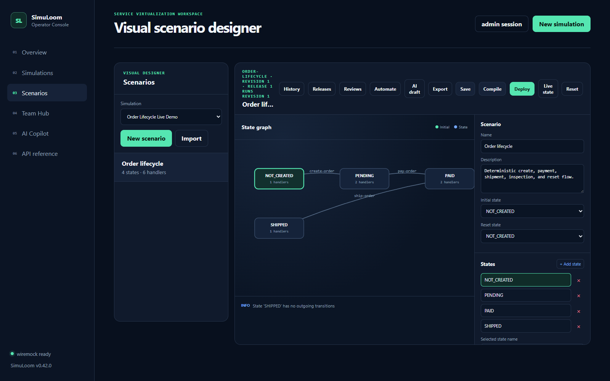
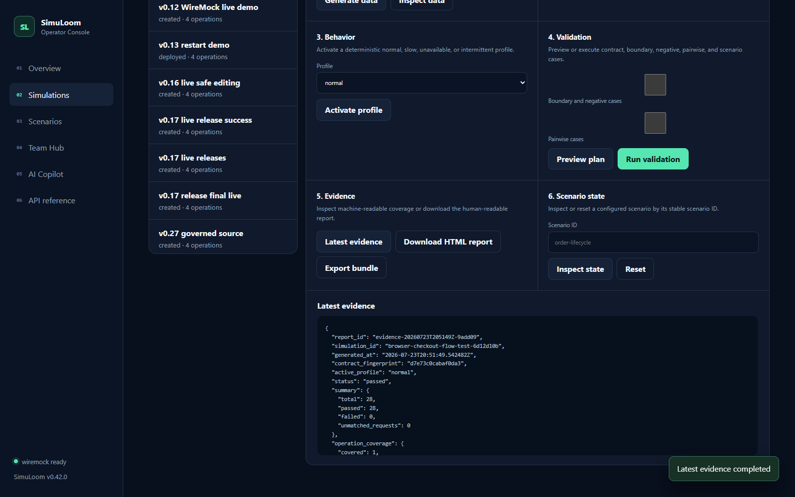
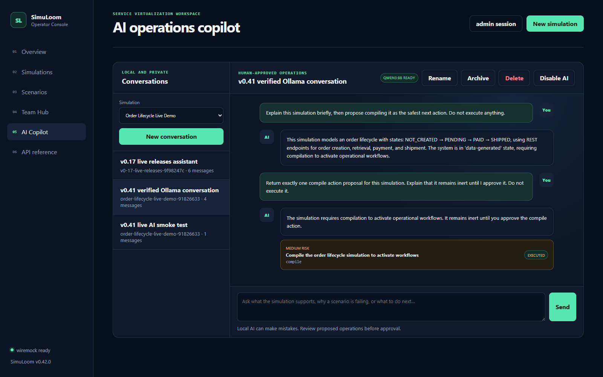

# Your client is ready. Its dependency is not.

It is late in the sprint. The checkout UI is working, but the order service is unfinished. The
shared payment sandbox cannot be reset, and the bug you need to reproduce appears only after an
order is created, paid, and then rejected during shipment.

A single `200 OK` mock will not help. Your team needs a dependency that remembers business state,
fails in controlled ways, and can prove what happened during a test run.

**That is the job SimuLoom is built for.** Give it an approved OpenAPI contract and it can produce
clearly synthetic data, deterministic virtual-service behavior, stateful scenarios, and validation
evidence. A developer can use the web console, CI can use REST, and an AI client can use MCP—all
through the same application services and safeguards.

SimuLoom `v0.42.0` is a public beta. It is useful for local development, integration testing,
demos, CI experiments, and learning. It does not claim a production SLA or replace testing
against the real provider.

## Five minutes from contract to working order journey

Prerequisites: Git, Docker, and Docker Compose.

```bash
git clone https://github.com/anzar-ahsan-commits/simuloom-mcp.git
cd simuloom-mcp
git checkout v0.42.0
docker compose up --build -d

curl --fail http://localhost:8000/api/v1/health
curl --fail http://localhost:8000/api/v1/readyz
```

When readiness returns `"status": "ready"`, open:

- operator console: <http://localhost:8000/ui>
- interactive REST documentation: <http://localhost:8000/docs>
- MCP endpoint: <http://localhost:8000/mcp>
- WireMock: <http://localhost:8080>

Now follow the copy-pasteable [order lifecycle](../examples/order-lifecycle/README.md). You will
create a fictional order, inspect it while pending, pay it, ship it, inspect the final result, and
reset the service for the next test:

```text
NOT_CREATED ── create ──> PENDING ── pay ──> PAID ── ship ──> SHIPPED
```

The important part is not the four labels. It is that every response and transition is tied to
the contract, reproducible after reset, and available as validation evidence.

## See the workflow

### Design a stateful service visually



The designer keeps the approved contract authoritative while exposing states, request handlers,
transitions, revisions, releases, and deployment controls in one view.

### Inspect validation evidence



Validation reports separate operation, scenario, boundary, negative, and pairwise coverage so a
passing HTTP response cannot hide an untested contract area.

### Ask the local AI Copilot



The optional local Copilot can explain grounded simulation context and propose allowlisted
operations. Proposed changes remain inert until an authorized operator explicitly approves them.

Stop the local stack when finished:

```bash
docker compose down
```

The named workspace volume is retained. Use `docker compose down --volumes` only when you
explicitly want to discard local SimuLoom state.

## Install the Python package

The signed public package is available from PyPI:

```bash
python -m pip install "simuloom-mcp==0.42.0"
python -c "import importlib.metadata as m; print(m.version('simuloom-mcp'))"
simuloom-gitops --help
```

The public container is:

```text
ghcr.io/anzar-ahsan-commits/simuloom-mcp:0.42.0
```

## Picture it in a real team

**Maya, frontend engineer:** develops against a stable order API before the upstream implementation
is available.

**Leo, QA engineer:** resets the exact same lifecycle before every test, then verifies boundaries,
invalid inputs, failures, and state transitions without touching customer data.

**Nora, platform engineer:** promotes an immutable scenario revision, runs it in CI, and shares
evidence showing precisely what the virtual environment covered.

**A local AI assistant:** explains why a validation failed and proposes compiling or deploying the
simulation. The proposal remains inert until an authorized person approves it.

One contract and one governed simulation serve all four workflows.

## Trust and safety model

- OpenAPI and saved scenario definitions—not AI output—are authoritative.
- Checked-in examples use clearly fictional synthetic identifiers.
- AI is local and opt-in through Ollama; proposed mutations require explicit approval.
- Authentication, role checks, audit evidence, encrypted secrets, and outbound-host allowlists are
  available when moving beyond a single-developer evaluation.
- Published Python and container artifacts include provenance attestations.

## Current beta boundaries

The default durable stores are SQLite-based and intended for a single application instance.
WireMock owns live state when it is the selected runtime. Browser-level UI regression automation,
distributed coordination, hosted identity providers, and a production support SLA remain roadmap
work. See the [technical guide](technical-guide.md) for the full architecture and limitations.

## Join the project

- Ask questions and share use cases in
  [GitHub Discussions](https://github.com/anzar-ahsan-commits/simuloom-mcp/discussions).
- Report reproducible defects with the bug form in
  [GitHub Issues](https://github.com/anzar-ahsan-commits/simuloom-mcp/issues).
- Read [CONTRIBUTING.md](../CONTRIBUTING.md) before proposing a change.
- Report vulnerabilities through GitHub private vulnerability reporting, not a public issue.

The most useful early feedback is concrete: the contract you tried, the workflow you expected,
where onboarding slowed down, and which evidence would help you trust the result.
