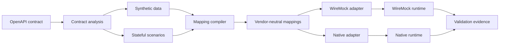

# SimuLoom Technical Guide

This guide explains what SimuLoom is, why it exists, how its components cooperate, where data is
stored, and how to operate or extend it safely. It targets engineers who understand HTTP and basic
testing but may be new to service virtualization, OpenAPI, MCP, or local AI.

## 1. The problem SimuLoom solves

Modern systems depend on services that may be unavailable, expensive, rate-limited, unfinished,
or unsafe to exercise with real customer data. A payment team may need an order service in a
specific state. A frontend team may need deterministic failures. A test suite may need thousands
of fictional but schema-valid records. SimuLoom creates controlled substitutes for those services.

The key design decision is that an approved OpenAPI contract remains the source of truth. SimuLoom
does not ask a language model to invent an API. It analyzes documented operations, generates
synthetic inputs, compiles deterministic mappings, and validates responses against documented
schemas. This makes a virtual service explainable and reproducible.

## 2. The core mental model

Think of SimuLoom as five layers:

1. **Contract layer** — reads and validates OpenAPI 3.x documents.
2. **Design layer** — stores datasets, profiles, and stateful scenarios.
3. **Compilation layer** — converts design artifacts into vendor-neutral runtime mappings.
4. **Runtime layer** — deploys mappings to WireMock or the native runtime.
5. **Evidence layer** — executes validation cases and records coverage and failures.

REST, MCP, the web console, GitOps, and the AI Copilot are interfaces around the same application
services. They are not independent implementations of simulation behavior.



## 3. Repository map

| Location | Responsibility |
| --- | --- |
| `src/simuloom/api` | FastAPI REST routes and native runtime façade |
| `src/simuloom/mcp` | MCP tools and read-only resources |
| `src/simuloom/core` | Domain services, compilers, validation, persistence helpers, AI boundary |
| `src/simuloom/adapters` | WireMock and native runtime adapters |
| `src/simuloom/runtime` | Native runtime state stores and portable mapping models |
| `src/simuloom/ui` | Bundled dependency-free operator console |
| `src/simuloom/models.py` | Pydantic request, response, and domain schemas |
| `examples` | Synthetic contracts and scenario demonstrations |
| `tests` | Unit, REST, MCP, deployment, security, UI, and live integration coverage |
| `deploy` | Kubernetes deployment assets |
| `.github/workflows` | CI, CodeQL, release, container, and PyPI automation |

`src/simuloom/container.py` is the composition root. It reads configuration, creates durable
stores, selects the runtime adapter, and wires shared services used by REST and MCP.

## 4. Contract processing

Contract analysis parses an OpenAPI document, extracts operations, response codes, parameters,
and schemas, and calculates a stable fingerprint. The fingerprint establishes identity: if the
contract changes, generated and compiled artifacts can be traced back to a different source.

Input contracts are size-bounded. Scenario request paths cannot target runtime administration
paths. Scenario response codes and JSON bodies must be compatible with documented responses where
schemas exist.

## 5. Synthetic data generation

The data engine walks request schemas and produces fictional values. A fixed seed makes output
reproducible. The generator supports path, query, header, cookie, and JSON-body inputs and marks
datasets as synthetic. Generated records are test fixtures, not anonymized production records.

Reproducibility is operationally important: the same contract, record count, and seed produce the
same logical test inputs. A failed CI run can therefore be recreated locally.

## 6. Stateful scenario orchestration

A scenario contains:

- a stable scenario ID;
- a name and description;
- an initial state;
- named states;
- request handlers in each state;
- optional request-triggered, event-triggered, or timeout transitions;
- deterministic responses;
- reset behavior.

For WireMock, SimuLoom compiles these concepts to `scenarioName`, `requiredScenarioState`, and
`newScenarioState`. The native runtime consumes the same vendor-neutral representation. Scenario
definitions support immutable revisions, ETags, comparison, reviews, releases, rollback,
promotion, and reusable parameterized templates.

## 7. Compilation and runtime adapters

Compilation produces portable runtime mappings. It can combine contract defaults, correlated
dataset responses, behavior profiles, edge cases, pairwise cases, and scenario mappings.

The `RuntimeAdapter` boundary prevents domain logic from depending directly on WireMock. The
WireMock adapter translates mappings to the WireMock Admin API. The native adapter stores and
serves mappings inside SimuLoom and can use memory or SQLite. Runtime capability discovery tells
clients which features and persistence guarantees are active.

## 8. Validation and evidence

Validation planning is read-only. It shows the exact cases that would run. Execution sends those
cases to the selected runtime and records:

- expected and actual status;
- response time;
- response-schema validity;
- scenario state before and after;
- operation, scenario, state, and transition coverage;
- boundary, negative, and pairwise coverage;
- unmatched requests and error details.

The latest report is available as JSON for automation and HTML for humans. The AI Copilot receives
only a bounded summary of this evidence, including up to ten failed cases, rather than entire
request or response bodies.

## 9. REST and MCP

FastAPI exposes versioned `/api/v1` operations and generates OpenAPI documentation at `/docs`.
MCP exposes equivalent tools and resources under `/mcp` using Streamable HTTP. Both interfaces
call the same `SimulationService`, stores, and runtime adapters.

Role checks are applied before domain operations:

- **viewer** — inspect, plan, and chat;
- **operator** — create, compile, deploy, validate, and approve bounded AI proposals;
- **admin** — global or security-sensitive operations and platform configuration.

When authentication is disabled, local development receives an admin principal. This is a
convenience mode and must not be used on an exposed deployment.

## 10. Persistence model

SimuLoom intentionally separates two persistence concerns.

### File workspace

Contracts, simulation metadata, datasets, scenarios, revisions, releases, reports, manifests, and
exports live in the versioned workspace format. Writes use atomic replacement and process-safe
locks. This structure remains portable and Git-friendly.

### Platform SQLite database

Team workspaces, memberships, jobs, metrics, integration circuits, encrypted secrets, AI
conversations, proposals, and platform settings live in a WAL-enabled SQLite database. Explicit
schema migrations prevent a newer database from being opened by older code. Version 5 adds
conversation archival.

The native runtime optionally uses a separate SQLite database for deployed mappings, scenario
state, and a bounded request journal.

## 11. AI Copilot trust boundary

The Copilot integrates with a separately operated Ollama server. The model receives:

- selected simulation metadata;
- documented operation identifiers, methods, paths, and response codes;
- scenario names, states, and transition counts;
- a bounded validation-evidence summary;
- at most twelve recent conversation messages.

It does not receive secrets, environment variables, arbitrary files, integration payloads, or
full runtime request bodies. User and contract text are explicitly treated as untrusted data.

Ollama must return schema-constrained JSON. SimuLoom validates the response with Pydantic. Scenario
drafts undergo an additional OpenAPI contract validation. Some Pydantic repetition hints are
removed only from the Ollama grammar because current Ollama grammar compilers reject large
repetitions; the original limits are still enforced after generation.

The model can propose only four operations: generate data, compile, deploy, or reset one scenario.
Proposals are persisted as inert records. An operator must approve a proposal, and an atomic SQL
claim ensures it executes at most once. No arbitrary tool or command execution exists.

## 12. Authentication, audit, and secrets

REST and MCP accept a bearer token or `X-API-Key`. Keys are statically configured today. Request
middleware records outcomes in an append-only hash-chained audit log; HMAC signing protects the
chain when a stable signing key is configured.

Workspace secrets use authenticated encryption and are returned only as metadata. Losing the
master key makes ciphertext unrecoverable. Outbound integrations require exact host allowlisting,
HTTPS by default, no redirects, HMAC signatures, idempotency keys, retries, and persistent circuit
state.

## 13. Operator console

The console is bundled HTML, CSS, and JavaScript with no CDN or analytics dependency. It supports
contract upload, simulation operation, visual scenario editing, team administration, and AI chat.
A strict Content Security Policy and text-only rendering boundaries reduce browser injection risk.
API keys are stored only in tab-scoped `sessionStorage`.

## 14. Deployment

The container runs as UID 10001, writes only to the workspace volume, and exposes readiness and
liveness probes. Compose is intended for local evaluation. Kubernetes assets demonstrate a
single-replica deployment with persistent storage. Production deployments should add TLS ingress,
network policies, external secrets, backups, resource tuning, and an identity provider.

Release tags build Python distributions and a GHCR image. GitHub Actions generates provenance
attestations. PyPI publication uses OIDC Trusted Publishing rather than a long-lived token.

## 15. Testing strategy

The default suite is deterministic and does not require external AI. `httpx.MockTransport`
validates provider requests and responses. WireMock and native integration suites verify runtime
behavior. Deployment tests inspect non-root execution and manifests. Security tests exercise role
boundaries, unsafe inputs, archive safety, SSRF controls, and audit integrity.

Before release, run:

```bash
uv run pytest -q
uv run ruff check .
uv run ruff format --check .
uv build
docker compose up --build -d
docker compose ps
curl --fail http://localhost:8000/api/v1/readyz
```

## 16. How to extend SimuLoom safely

When adding a runtime feature, define vendor-neutral models first, implement it in the shared
service layer, extend adapter capabilities, then expose REST and MCP interfaces. Add compatibility
tests before UI controls.

When adding an AI capability, keep context bounded, define a strict output schema, validate again
outside the model, make mutations explicit and allowlisted, and require an authenticated human
decision. Never give a model direct access to the repository, shell, secret vault, or runtime admin
API.

## 17. Current limitations

- Static API keys rather than OIDC and short-lived sessions.
- SQLite control-plane storage and one application replica.
- Non-streaming AI responses and no distributed inference queue.
- No external policy engine or distributed rate limiter.
- WireMock scenario state is shared when using one WireMock runtime.
- Community governance and compatibility policy are still maturing during public beta.

These are explicit public-beta constraints, not hidden production guarantees.
